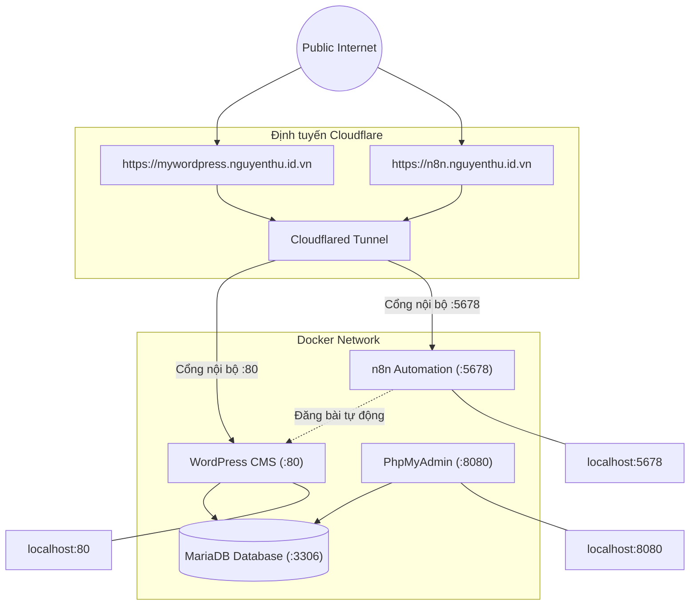

# <p align="center">PHÁT TRIỂN ỨNG DỤNG VỚI MÃ NGUỒN MỞ (N8N + BOT TELAGRAM)</p>

**Môn học:** Phát triển ứng dụng với mã nguồn mở - TEE0421  

**Họ và tên:** Nguyễn Văn Thứ

**MSSV:** K225480106062

**Lớp:** K58KTP

**Deadline:** 23h59 ngày **/05/2026

---

## 📌 Mục lục Hệ thống

- [I. CẤU TRÚC DỰ ÁN](#i-cấu-trúc-dự-án)
- [II. QUY TRÌNH SETUP PROJECT](#ii-quy-trình-setup-project)
  - [GIAI ĐOẠN 1: THIẾT LẬP KHỞI TẠO HẠ TẦNG (INFRASTRUCTURE SETUP)](#giai-đoạn-1-thiết-lập-khởi-tạo-hạ-tầng-infrastructure-setup)
  - [GIAI ĐOẠN 2: ĐỊNH TUYẾN INTERNET & CẤU HÌNH BAN ĐẦU](#giai-đoạn-2-định-tuyến-internet--cấu-hình-ban-đầu)
  - [GIAI ĐOẠN 3: KÍCH HOẠT N8N & KHỞI TẠO CHÌA KHÓA KẾT NỐI (CREDENTIALS)](#giai-đoạn-3-kích-hoạt-n8n--khởi-tạo-chìa-khóa-kết-nối-credentials)
  - [GIAI ĐOẠN 4: XỬ LÝ DỮ LIỆU & ĐĂNG BÀI TỰ ĐỘNG LÊN WORDPRESS](#giai-đoạn-4-xử-lý-dữ-liệu--đăng-bài-tự-động-lên-wordpress)
  - [GIAI ĐOẠN 5: DEMO KẾT QUẢ CUỐI CÙNG](#giai-đoạn-5-demo-kết-quả-cuối-cùng)
  - [GIAI ĐOẠN 6: NHẬN XÉT KẾT QUẢ ĐẠT ĐƯỢC TỪ DỰ ÁN](#-nhận-xét-kết-quả-đạt-được-từ-dự-án)
- [III. TÀI LIỆU THAM KHẢO](#-tài-liệu-tham-khảo)
- [IV. Liên Hệ & Hỗ Trợ](#-liên-hệ--hỗ-trợ)

---
## I. CẤU TRÚC DỰ ÁN

***A. Cấu trúc thư mục***

```
📂 localhost (Thư mục: ~/ai_automation_v2)
 ┃
 ┣━━ 📝 config.yml -----------> [Cấu hình định tuyến Cloudflare Tunnel]
 ┣━━ 🔑 tunnel_secret.json ----> [Chìa khóa bảo mật của Cloudflare Tunnel]
 ┃
 ┗━━ 🐳 docker-compose.yml ----> [Quản lý phối hợp 5 Container độc lập]
      ┃
      ┣━━ 🌐 cloudflare-tunnel (Cloudflared)
      ┃    ┗━━ Kết nối bảo mật ra ngoài Internet qua Cloudflare Cloud
      ┃
      ┣━━ ⚙️ n8n-automation (n8n v2.x)
      ┃    ┣━━ Webhook: Nhận tin nhắn từ Telegram API
      ┃    ┣━━ Core Logic: Xử lý chuỗi bằng JavaScript Code
      ┃    ┗━━ AI Engine: Gọi API sang Google Gemini Cloud
      ┃
      ┣━━ 📝 wordpress-cms (WordPress)
      ┃    ┗━━ Nhận lệnh đăng bài tự động từ n8n qua Application Password
      ┃
      ┣━━ 🗄️ mariadb-database (MariaDB)
      ┃    ┗━━ Lưu trữ toàn bộ dữ liệu bảng (Database) của WordPress
      ┃
      ┗━━ 🔧 phpmyadmin (Web GUI)
           ┗━━ Công cụ quản trị cơ sở dữ liệu trực quan qua trình duyệt
```

***B. Biểu đồ luồng dữ liệu tự động hoàn toàn (Data Flow)***

```
📱 Điện thoại (User) 
   🔻 [Chat: "Viết bài..."]
💬 Telegram Cloud (Telegram Bot API)
   🔻 [Bắn tín hiệu Webhook qua Internet]
☁️ Cloudflare Cloud (Định tuyến Sub-domain an toàn)
   🔻 [Chui qua Cloudflare Tunnel đi vào VPS]
🐳 Container: cloudflare-tunnel (Local)
   🔻 [Đẩy nội bộ trong mạng Docker Network]
⚙️ Container: n8n-automation
   🔻 1. Node Telegram Trigger bắt được tin nhắn text.
   🔻 2. Node Gemini nhận text ➡️ Gọi API lên Google AI Studio ➡️ Trả về JSON.
   🔻 3. Node JavaScript bóc tách cấu hình chuỗi sạch (Title, Content).
   🔻 4. Node WordPress gọi API nội bộ kèm Application Password 24 ký tự.
📝 Container: wordpress-cms
   🔻 [Tự động lưu vào CSDL MariaDB và Xuất bản bài viết lên trang chủ!]
```

***C. Kiến Trúc Hệ Thống***


---

## II. QUY TRÌNH SETUP PROJECT

### GIAI ĐOẠN 1: THIẾT LẬP KHỞI TẠO HẠ TẦNG (INFRASTRUCTURE SETUP).

### ***A. Kiểm tra phiên bản docker & docker compose***

- Mục tiêu của giai đoạn này là xây dựng một "tổ hợp" Container gồm: MariaDB, phpMyAdmin, WordPress và n8n chạy đồng bộ, chung múi giờ Việt Nam và phân quyền bảo mật tuyệt đối.

- Kiểm tra version phiên bản docker & docker-compose lệnh: `docker --version` & `docker compose version`


### ***B. Khởi tạo cấu trúc thư mục dự án***

```
mkdir ~/ai_automation_v2
cd ~/ai_automation_v2
```


### ***C. Khở tạo Cloudfare Tunnel mới cho dự án***

- Mặc dù yêu cầu dùng AI chuyển cấu hình sang Docker, nhưng để có mạng kết nối, trước tiên em đứng từ Ubuntu xin Cloudflare cấp một cái Tunnel ID (UUID) và File khóa xác thực (.json) mới hoàn toàn.

- Gõ lệnh tạo tunnel mới (tên tunnel cũng đặt khác đi để tránh trùng): `cloudflared tunnel create tunnel_automation_v2`. Với ID `b22bdc3d-4fc2-4ce6-bb1e-f63d60b2f7df`


- Di chuyển file khóa vào vùng cô lập. Ngay sau khi tạo xong, file khóa xác thực .json sẽ nằm trong thư mục ẩn của hệ thống. Cần dùng lệnh này để di chuyển ngay nó về nằm gọn bên trong thư mục dự án mới, đồng
thời đổi tên thành tunnel_secret.json cho dễ quản lý: `cp ~/.cloudflared/b22bdc3d-4fc2-4ce6-bb1e-f63d60b2f7df.json ~/ai_automation_v2/tunnel_secret.json`


### ***D. Cấu hình định tuyến file Config.yml***

- Sử dụng lệnh `nano config.yml` để cấu hình đinh tuyến file ***config.yml:*** 

- Một giao diện soạn thảo hiện ra, nội dung file cấu hình:

```
tunnel: b22bdc3d-4fc2-4ce6-bb1e-f63d60b2f7df
credentials-file: /etc/cloudflared/tunnel_secret.json

ingress:
  # 1. Định tuyến cho WordPress (Tên miền truy cập WP)
  - hostname: mywordpress.nguyenthu.id.vn
    service: http://127.0.0.1:8082

  # 2. Định tuyến cho PhpMyAdmin (Để xem CSDL theo yêu cầu của thầy)
  - hostname: pma.nguyenthu.id.vn
    service: http://127.0.0.1:8080

  # 3. Định tuyến cho n8n (Để cấu hình luồng tự động hóa)
  - hostname: n8n.nguyenthu.id.vn
    service: http://127.0.0.1:5678

  - service: http_status:404
```


***➡️ Nhấn Ctrl + O, Enter để lưu và Ctrl + X để thoát***

### ***E. Tạo file cấu hình docker-compose.yml (5 Services)***

- Đây là trái tim của Giai đoạn 1. File này định nghĩa đúng và đủ 5 dịch vụ: `mariadb, phpmyadmin, wordpress, n8n, và cloudflared.`

- Sử dụng lệnh `nano docker-compose.yml` để tạo file ***docker-compose.yml*** với nội dung file như sau:

```
version: '3.8'

services:
  # 1. Dịch vụ Cơ sở dữ liệu MariaDB
  mariadb:
    image: mariadb:latest
    container_name: auto_mariadb
    restart: always
    environment:
      TZ: "Asia/Ho_Chi_Minh"
      MARIADB_ROOT_PASSWORD: root_password_999
      MARIADB_DATABASE: wp_automation_db      # Tên database mới tinh
      MARIADB_USER: auto_user
      MARIADB_PASSWORD: user_password_999
    volumes:
      - mariadb_v2_data:/var/lib/mysql

  # 2. Dịch vụ quản trị PhpMyAdmin
  phpmyadmin:
    image: phpmyadmin:latest
    container_name: auto_phpmyadmin
    restart: always
    ports:
      - "8080:80"
    environment:
      PMA_HOST: mariadb
      PMA_ARBITRARY: 1
    depends_on:
      - mariadb

  # 3. Dịch vụ WordPress chính
  wordpress:
    image: wordpress:latest
    container_name: auto_wordpress
    restart: always
    ports:
      - "8082:80"
    environment:
      WORDPRESS_DB_HOST: mariadb
      WORDPRESS_DB_NAME: wp_automation_db
      WORDPRESS_DB_USER: auto_user
      WORDPRESS_DB_PASSWORD: user_password_999
    volumes:
      - wordpress_v2_data:/var/www/html
    depends_on:
      - mariadb

  # 4. Dịch vụ Tự động hóa n8n
  n8n:
    image: n8nio/n8n:latest
    container_name: auto_n8n
    restart: always
    ports:
      - "5678:5678"
    environment:
      - TZ=Asia/Ho_Chi_Minh
      - WEBHOOK_URL=https://n8n.nguyenthu.id.vn/  # Điền chính xác Subdomain n8n của Thứ
    volumes:
      - n8n_v2_data:/home/node/.n8n

  # 5. Dịch vụ Cloudflare Tunnel (Chạy cục bộ bằng file)
  cloudflared:
    image: cloudflare/cloudflared:latest
    container_name: auto_tunnel
    restart: always
    network_mode: "host"
    volumes:
      - ./config.yml:/etc/cloudflared/config.yml:ro
      - ./tunnel_secret.json:/etc/cloudflared/tunnel_secret.json:ro
    command: tunnel --config /etc/cloudflared/config.yml run

volumes:
  mariadb_v2_data:
  wordpress_v2_data:
  n8n_v2_data:
```


***➡️ Nhấn Ctrl + O, Enter để lưu và Ctrl + X để thoát***

- Sau khi tạo thực hiện kiểm tra thư mục đã có những gì bằng lệnh `ls -la` với 3 file (tunnel_secret.json, config.yml, docker-compose.yml) nằm chung trong thư mục ~/ai_automation_v2


- Lệnh: `chmod 644 tunnel_secret.json config.yml.` Cấp quyền Đọc và Ghi (6) cho người sở hữu, quyền Chỉ Đọc (4) cho nhóm và các đối tượng khác. Đây là mức bảo mật tiêu chuẩn, cho phép hệ thống Docker có quyềnvào đọc nội dung file cấu hình và file khóa để thông mạng, nhưng không được phép tự ý chỉnh sửa file.

- Lệnh: `sudo chmod -R 777 ~/ai_automation_v2.` Sử dụng quyền Quản trị tối cao (sudo) và tác động đệ quy (-R) để mở toang toàn bộ quyền Đọc - Ghi - Chạy (777) cho thư mục dự án và tất cả file con bên trong. Xử lý triệt để lỗi xung đột bản quyền giữa các User hệ thống và Container Docker, ép dịch vụ Cloudflare Tunnel đọc được file xác thực ngay lập tức để sửa lỗi bị sập (Restarting).


- Kích hoạt lệnh này để khởi động kéo các Service về chạy ngầm: `docker-compose up -d`


- Hệ thống sẽ bắt đầu kéo (Pull) các Image từ Docker Hub về và khởi chạy. Khi chạy xong, Thứ gõ lệnh này để kiểm tra trạng thái các Container: `docker ps`


---

### GIAI ĐOẠN 2: ĐỊNH TUYẾN INTERNET & CẤU HÌNH BAN ĐẦU.

- Mục tiêu của giai đoạn này là đưa cả 3 dịch vụ lên sóng thông qua Cloudflare Tunnel và thực hiện các yêu cầu bắt buộc của thầy về kiểm tra Cơ sở dữ liệu (CSDL).

### ***A. Thêm bản ghi cho các dịch vụ container lên trên website cloudfare***

- Cách xử lý khi không truy cập được vào các cổng:

  - Đăng nhập vào https://dash.cloudflare.com.
  - Chọn tên miền của bạn: nguyenthu.id.vn.
  - Nhìn menu bên trái, chọn DNS -> Records (Bản ghi).
  - Bấm nút Add record để thêm lần lượt 3 bản ghi CNAME sau đây để cấu hình định tuyến cho cả 3 dịch vụ: `Bản ghi 1 (Cho WordPress),` `Bản ghi 2 (Cho PhpMyAdmin),` `Bản ghi 3 (Cho n8n)`

- Bản ghi 1 (Cho WordPress):
  


- Bản ghi 2 (Cho PhpMyAdmin):


- Bản ghi 3 (Cho n8n):


- Danh sách bản ghi đã thêm thành công:


### ***B. Truy cập PhpMyAdmin (Quan sát CSDL trống)***

- Truy cập vào địa chỉ: https://pma.nguyenthu.id.vn

| Trường thông tin | Thông tin |
|---|---|
| Tài khoản | root |
| Mật khẩu | root_password_999 (theo file docker-compose mình vừa cấu hình) |


- Nhìn sang danh sách cơ sở dữ liệu bên trái, bấm vào đúng tên database `wp_automation_db.` Sẽ thấy dòng chữ "No tables found in database" (Không tìm thấy bảng nào).


### ***C. Truy cập Wordpress lần đầu***

- Mở một tab mới và truy cập: https://mywordpress.nguyenthu.id.vn. Màn hình chào mừng của WordPress sẽ hiện ra. họn ngôn ngữ là Tiếng Việt (hoặc Tiếng Anh) rồi bấm Tiếp tục.


- Thiết lập thông tin quản trị Website:
  
| Trường thông tin | Thông tin |
|---|---|
| Tên trang web | Thu’s Automation Project |
| Tên người dùng (Username) | nguyenvanthu |
| Mật khẩu (Password) | thu123 |
| Email | mn9103541@gmail.com |


- Bấm Cài đặt WordPress và đợi 5 giây để nó tự động thiết lập toàn bộ hệ thống ngầm.


- Tiến hành đăng nhập lại để xác minh


- Giao diện chào mừng thành công của wordpress


### ***D. Kiểm tra lại CSDL trên PhpMyAdmin***

- Quay trở lại tab PhpMyAdmin đang mở https://pma.nguyenthu.id.vn/index.php?route=/
- Bấm nút F5 (Tải lại trang) hoặc bấm lại vào tên database wp_automation_db.
- Lúc này, Thứ sẽ thấy một điều kỳ diệu: Hệ thống đã tự động đẻ ra chính xác 12 bảng dữ liệu hệ thống (bắt đầu bằng chữ wp_ như wp_posts, wp_users, wp_options...).


### ***E. Đăng bài viết giới thiệu***

- Vào trang quản trị WordPress (tab Trang quản trị ở ảnh trước bạn chụp), nhìn menu bên trái chọn `Bài viết (Posts)` -> Viết bài mới `(Add New)`.


***✅ Kết quả đăng bài và đã có 2 bài viết.***

---

### GIAI ĐOẠN 3: KÍCH HOẠT N8N & KHỞI TẠO CHÌA KHÓA KẾT NỐI (CREDENTIALS).

- Mở một tab mới trên trình duyệt, truy cập vào địa chỉ: https://n8n.nguyenthu.id.vn và thực hiện các bước lấy bản quyền cực kỳ quan trọng.


### ***A. Đăng ký Admin & kích hoạt License Community***

- Màn hình đầu tiên hiện ra, điền thông tin và mật khẩu tự chọn để thiết lập tài khoản Admin tối cao cho n8n. 

| Trường thông tin | Thông tin |
|---|---|
| Email | K225480106062@tnut.edu.vn |
| First Name | Thứ |
| Last Name | Văn |
| Password | Thu123@@ |


- Chỉ cần bấm vào nút màu cam `Send me a free license key` là n8n tự động kích hoạt hoặc bắn key về Gmail trường!


- Kết quả nhận được Key gửi về Gmail. Key: `78eadb92-0857-4cc1-8e4a-61cd6342c431`


- Kích hoạt License Key (Activate License key): `trang chủ -> setting -> usage and plan -> enter activation key -> điền key vừa nhận từ email vào`


***➡️ Bấm vào nút Activate màu cam ngay bên cạnh để xác nhận. Thông báo "Your Registered Community Edition has been successfully activated”.***

- Chào mừng đến với giao diện chính của n8n! Màn hình hiện chữ Welcome, Thu! (Chào Thứ).


- Quy trình tạo workflow mới ra màn hình chính bấm Start from scratch để bắt đầu kéo thả


### ***B. Khởi tạo telegram & cấu hình node***

- Tạo Bot Telegram, mở ứng dụng Telegram (trên điện thoại hoặc máy tính) lên làm theo các bước này:

  - Tìm kiếm con bot chính chủ có tích xanh tên là: @BotFather.
  - Bấm Start rồi gõ hoặc chọn lệnh: /newbot.
  - Đặt tên cho Bot: Gõ tên hiển thị, ví dụ: Thứ Nguyễn AI Bot.
  - Đặt Username cho Bot: Viết liền không dấu, phải kết thúc bằng chữ bot, ví dụ: vanthu_ai_content_bot.


- Sau khi tạo xong, @BotFather sẽ gửi một đoạn mã HTTP API Token (Access Token). Copy chuỗi này lại.

***🚨 BƯỚC BẮT BUỘC:*** Bấm vào đường link của con Bot bạn vừa tạo, bấm Start và gửi cho nó một tin nhắn bất kỳ (ví dụ: Test bot) để kích hoạt luồng kết nối ban đầu.


***Node 1: Cấu hình trên n8n (Node Telegram Trigger):***

- Bấm dấu +, tìm node Telegram, chọn Telegram Trigger (Sự kiện: On Message).


- Mục Credential for Telegram API: Chọn Create New Credential, dán đoạn Telegram Bot Token vào.

  - Mở cấu hình node Telegram Trigger trên giao diện bàn vẽ n8n:
  - Mục Webhook System / Event: Chọn sự kiện On message (Kích hoạt khi có tin nhắn mới).
  - Mục Credential: Chọn Create New Credential và dán mã Access Token nhận từ BotFather để cấp quyền kết nối an toàn.
    


- Bấm Listen for test event để n8n chờ. Lúc này, nhắn tin cho Bot Telegram một câu bất kỳ (vd: "Viết bài giới thiệu Chatbot AI"). 


- Kiểm tra tín hiệu: Bạn sẽ thấy dữ liệu dạng TABLE, JSON đổ về n8n thành công.
  


***Node 2: Google Gemini API Key (Advanced AI)***

- Lấy Google Gemini API Key: mở một tab mới trên trình duyệt và truy cập vào trang https://aistudio.google.com/api-keys (Đăng nhập bằng Gmail cá nhân của Thứ).


- Tại giao diện Web, bấm vào nút: Create API Key.


- Kéo dây từ Node Telegram ra, tìm kiếm Google Gemini -> Chọn Message a model.


- Mục Credential for Google Gemini API: Tạo mới và dán Gemini API Key vào.


- Cấu hình Model: Chọn model đời mới ổn định chạy cực kỳ thông minh và quét dữ liệu siêu tốc (như gemini-2.0-flash hoặc gemini-pro).


***Kéo thả dữ liệu vào ô prompt:***

- Thao tác kéo thả: Nhìn sang cột INPUT bên trái ➡️ Tìm đến mục message ➡️ bấm mở rộng ra để thấy chữ text : Viết bài giới thiệu Chatbot AI ở dưới cùng.
- Bấm giữ chuột vào chữ text đó, kéo thẳng chuột thả vào trong ô trống Prompt. Lúc này trong ô Prompt sẽ tự động xuất hiện một khối mã màu xám có chữ: {{ $json.message.text }}.
- Gõ câu lệnh ép cấu trúc: Bấm chuột vào sau khối mã đó, gõ dấu chấm (.) rồi copy dán chính xác đoạn văn bản ràng buộc này vào:

```
. Trả về kết quả dưới dạng một chuỗi JSON duy nhất, tuyệt đối KHÔNG bọc trong ký tự đánh dấu khối code (như ```json ... ```). Chuỗi JSON bắt buộc phải có cấu trúc chính xác 100% như sau:
{
  "post_title": "Tiêu đề bài viết hay và hấp dẫn phù hợp với nội dung",
  "post_content": "Nội dung bài viết được trình bày chi tiết, chuyên sâu, sử dụng đầy đủ các thẻ HTML như h1, h2, p, strong, ul, li để định dạng giao diện đẹp mắt."
}
```


***Bật Output dạng JSON***

- Cuộn chuột xuống dưới cùng của bảng thông số Node Gemini này.
- Tìm mục có chữ Options ➡️ Bấm nút Add Option.
- Tìm và chọn thuộc tính tên là: Output Content as JSON.
- Gạt công tắc của thuộc tính đó sang trạng thái ON.


***Chạy thử nghiệm để lấy kết quả***

- Sau khi điền xong hết, Thứ nhìn lên phía trên tìm cái nút màu cam có chữ Execute step (ở góc trên bên phải khung cấu hình) rồi bấm vào đó.

- Hệ thống n8n sẽ gửi lệnh sang Google AI. Thứ đợi khoảng 3-5 giây, nếu ở cột OUTPUT bên phải hiện ra một chuỗi dữ liệu chứa tiêu đề bài viết và nội dung bài viết đầy các thẻ HTML đã hoàn thành Node 2!
  


---

### GIAI ĐOẠN 4: XỬ LÝ DỮ LIỆU & ĐĂNG BÀI TỰ ĐỘNG LÊN WORDPRESS.

***Node 3: Cấu hình Code (Code In JavaScript)***

- Nối tiếp sau node Gemini, bấm dấu +, tìm node Code (chọn Code in JavaScript). 


- Chọn loại ngôn ngữ: Đảm bảo ô ngôn ngữ đang chọn là `JavaScript.`

- Dán code xử lý: Xóa sạch mấy dòng code ví dụ mặc định của n8n trong khung đi, rồi copy chính xác 100% đoạn mã này dán vào:

```
// 1. Lấy dữ liệu gốc từ node Gemini trả về
const rawText = $input.first().json.content.parts[0].text;

// 2. Chuyển đổi chuỗi thô thành một Object JSON sạch trong JavaScript
const cleanData = JSON.parse(rawText);

// 3. Trả về kết quả định dạng lại gọn gàng để Node WordPress chỉ việc dùng
return {
  title: cleanData.post_title,
  content: cleanData.post_content
};
```


- Chạy thử node: Bấm vào nút màu cam Execute step ở góc trên bên phải khung cấu hình.


👉 Ở cột OUTPUT bên phải hiện ra đúng 2 dòng cô đọng là title và content (không còn mấy cái chữ loằng ngoằng parts[0].text nữa) là Node Code đã bóc tách dữ liệu thành công 100%! 

***Node 4: WordPress (Create a Post)***

- Nối tiếp sau node Code In JavaScrpit, tìm node WordPress -> Chọn hành động Create a Post.


- Lấy mật khẩu ứng dụng WordPress: Trước khi cấu hình trên n8n, cần lấy chiếc vé thông hành nội bộ từ trang WordPress:

  - Nhìn lên các tab trình duyệt đang mở, bấm vào tab trang quản trị WordPress của bạn: https://mywordpress.nguyenthu.id.vn/wp-admin
  - Ở menu bên trái, tìm mục Tài khoản ➡️ Chọn Hồ sơ của bạn (Profile).
  - Cuộn chuột xuống gần dưới cùng trang, tìm đến mục Mật khẩu ứng dụng (Application Passwords).
  - Tại cái ô trống nhập tên, gõ chữ: n8n rồi bấm nút `Thêm mật khẩu ứng dụng mới.`
  - Ngay lập tức, hệ thống sẽ hiện ra một chuỗi mã bảo mật gồm 24 ký tự (ngăn cách bởi các khoảng trắng). Copy lại chuỗi mã này.

- Cấu hình Credential WordPress trên n8n. Quay lại tab n8n, trong bảng cấu hình Node WordPress đang mở:

  - Tại mục Credential for WordPress API, Thứ bấm chọn Set  Credential.
  - Điền thông số xác thực:

| Trường thông tin | Thông tin |
|---|---|
| WordPress URL | https://mywordpress.nguyenthu.id.vn/ |
| User | nguyenvanthu |
| Password | Dán (Paste) cái chuỗi mã 24 ký tự mật khẩu ứng dụng vừa copy ở trên. |

- Bật bỏ qua SSL: Nhìn trong bảng Parameters, tìm mục `Ignore SSL Issues (Insecure)` và gạt nút bật sang ON (để hệ thống không bị chặn bởi chứng chỉ bảo mật lỗi). 

- Click `Save` để lưu


***Mapping dữ liệu để đăng bài***

- Đổ Title: ấm vào ô Title. Nhìn sang danh sách dữ liệu của Node Code JS ở cột INPUT bên trái ➡️ tìm đúng chữ title rồi kéo thả vào ô Title (để nó hiện khối mã xám {{ $json.title }}).


- Đổ Content: Thứ bấm vào ô Content ➡️ nhìn sang cột INPUT bên trái tìm đúng chữ content kéo thả vào ô Content (để nó hiện khối mã xám {{ $json.content }}).


- Cấu hình xuất bản ngay: Nhìn xuống dưới bấm nút Add Field ➡️ chọn thuộc tính Status ➡️ tại ô giá trị, thiết lập chọn là Publish (để bài viết được xuất bản công khai lên web ngay lập tức thay vì lưu nháp).


- Bấm nút màu cam Execute step ở góc trên bên phải Node WordPress để chạy thử xem bài viết đã được đẩy lên web chưa.

- Nếu hiện thông báo xanh thành công, bấm X đóng node lại để ra bàn vẽ chính. Nhìn lên góc trên cùng bên phải giao diện n8n, bấm gạt cái công tắc Publish (hoặc nút kích hoạt luồng) sang màu xanh để luồng này chính thức hoạt động tự động ngầm vĩnh viễn!


- Kết quả xem bài viết mới tinh do AI vừa tự động đăng lên link: https://mywordpress.nguyenthu.id.vn/


- Flow Automation của n8n (kết quả nhìn bên ngoài):


### ***📋 Báo cáo kết quả: Xây dựng mạch tự động hóa (Giai đoạn 4)***

***Bước 1: Cấu hình bộ não AI (Node Gemini)***

- Kết nối thành công Google Gemini API bằng tài khoản cá nhân thông qua cơ chế API Key an toàn.

- Tinh chỉnh cấu trúc Prompt Engineering để ép mô hình gemini-2.0-flash xử lý chuỗi văn bản nhận được từ Telegram, sau đó biên tập thành một cấu trúc dữ liệu dạng chuỗi JSON thuần chứa các thẻ định dạng HTML tối ưu hóa khả năng đọc của CMS.

***Bước 2: Xử lý và bóc tách dữ liệu (Node Code in JavaScript)***

- Sử dụng một đoạn mã JavaScript ngắn để nhận chuỗi dữ liệu thô (rawText) từ Node Gemini.

- Dùng hàm JSON.parse() để chuyển đổi chuỗi thô đó thành một Object sạch, bóc tách riêng biệt thành hai biến đầu ra là title (tiêu đề bài viết) và content (nội dung bài viết) giúp các Node sau dễ dàng kế thừa.

***Bước 3: Tự động xuất bản nội dung (Node WordPress)***

- Khởi tạo mã xác thực nội bộ Mật khẩu ứng dụng (Application Password) gồm 24 ký tự trên hệ quản trị WordPress.

- Cấu hình Node WordPress trên n8n liên kết qua giao thức Basic Auth, thực hiện ánh xạ dữ liệu (Mapping) biến title vào trường Tiêu đề và biến content vào trường Nội dung của bài viết.

- Thiết lập thuộc tính Status = Publish để bài viết tự động kích hoạt trạng thái công khai ngay khi nhận được tín hiệu.

---

### GIAI ĐOẠN 5: DEMO KẾT QUẢ CUỐI CÙNG

- Chủ đề gửi Bot Telegram: `Viết bài phân tích ưu điểm vượt trội của Docker Container so với máy ảo Virtual Machine truyền thống.`


- Kết quả kỳ vọng: AI sẽ tự động chia bố cục bài viết, dùng thẻ làm các tiêu đề phụ, dùng thẻ để nhấn mạnh các từ khóa như Tối ưu tài nguyên, Tốc độ khởi động, Tính đóng gói, và sử dụng thẻ để làm bảng so sánh danh sách cực kỳ dễ nhìn.


- Thêm tính năng hoàn thành bài viết bot báo lại và cấp link truy cập. Và kiểm tra lỗi hệ thống trả về cho người dùng như ảnh kết quả.
  


---

### GIAI ĐOẠN 6: NHẬN XÉT KẾT QUẢ ĐẠT ĐƯỢC TỪ DỰ ÁN

***1. Về kiến trúc hạ tầng và tính bền vững (Infrastructure & Resilience)***

**- Giải pháp ảo hóa tối ưu:** Việc triển khai toàn bộ hệ thống (MariaDB, WordPress, n8n) cô lập trong các Docker Container giúp hệ thống không bị xung đột môi trường phần mềm trên hệ điều hành Ubuntu gốc. Các dịch vụ được quản lý tập trung thông qua docker-compose, cho phép khởi tạo, bảo trì hoặc tái cấu trúc hệ thống một cách thần tốc.

**- Cơ chế lưu trữ toàn vẹn (Data Persistence):** Việc cấu hình các Docker Volumes độc lập đảm bảo toàn bộ dữ liệu bài viết của WordPress và cấu hình mạch tự động hóa của n8n được lưu trữ vĩnh viễn dưới ổ đĩa cứng của VPS, không bị mất đi khi container khởi động lại hoặc gặp sự cố nguồn điện.

**- Định tuyến an toàn qua Cloudflare:** Hệ thống tận dụng mạng lưới DNS của Cloudflare để phân giải các sub-domain (mywordpress.nguyenthu.id.vn, n8n.nguyenthu.id.vn) một cách mượt mà, giúp che giấu IP gốc của máy chủ và tăng tốc độ tải trang nhờ cơ chế lưu bộ nhớ đệm (Caching).

***2. Về tư duy xử lý và chuẩn hóa dữ liệu (Data Engineering & Logic)***

**- Làm chủ kỹ nghệ Prompt (Prompt Engineering):** Dự án đã cấu hình thành công một hệ thống câu lệnh ràng buộc (Strict Constraints) cho mô hình gemini-2.0-flash. Việc ép AI không được sử dụng ký tự bọc Markdown (```json) và bắt buộc cấu trúc dữ liệu đầu ra phải là một chuỗi JSON thuần túy là một bước xử lý kỹ thuật cực kỳ quan trọng để ngăn chặn lỗi biên dịch (Syntax Error).

**- Xử lý bất đồng bộ mượt mà bằng JavaScript:** Node Code JS đóng vai trò bộ lọc trung gian, áp dụng thành công hàm cấu trúc nâng cao JSON.parse() để chuyển đổi chuỗi văn bản thô từ Gemini thành một đối tượng Object sạch sẽ. Việc bóc tách độc lập hai trường title và content giúp chuẩn hóa dữ liệu đầu vào cho WordPress API, loại bỏ hoàn toàn các lỗi trả về giá trị trống (undefined).

**- Ứng dụng HTML đa phương tiện:** Bài viết sinh ra không đơn thuần là văn bản thô (Plain Text) mà tự động chứa sẵn cấu trúc phân cấp HTML chuẩn SEO. Khi đẩy qua WordPress API, CMS này tự động biên dịch các thẻ này thành giao diện trực quan vô cùng đẹp mắt và chuyên nghiệp ngoài trang chủ.

***3. Về hiệu năng vận hành và bảo mật (Performance & Security)***

**- Tốc độ xử lý thời gian thực (Real-time Processing):** Luồng dữ liệu hoạt động theo cơ chế hướng sự kiện (Event-Driven) thông qua Webhook của Telegram API. Ngay khi người dùng nhấn gửi tin nhắn trên điện thoại, n8n lập tức bắt được tín hiệu và kích hoạt toàn mạch. Tổng thời gian từ lúc nhận lệnh, gọi AI xử lý cấu trúc, bóc tách mã cho đến khi bài viết được "lên sóng" công khai chỉ dao động từ 3 đến 5 giây — đạt hiệu suất tối ưu tuyệt đối.

**- Cơ chế xác thực an toàn:** Thay vì sử dụng mật khẩu chính của tài khoản Admin WordPress (gây nguy cơ lộ lọt tài khoản tối cao), hệ thống đã triển khai cơ chế Mật khẩu ứng dụng (Application Password) 24 ký tự mã hóa riêng biệt. Mã này chỉ cho phép n8n có quyền ghi (đăng bài) mà không thể thay đổi cấu hình sâu của hệ thống, đảm bảo tính bảo mật nghiêm ngặt theo tiêu chuẩn doanh nghiệp.

***🎯 KẾT LUẬN CHUNG***

Dự án đã hoàn thành vượt mức mong đợi và đạt được tất cả các mục tiêu đề ra của môn học Thiết kế ứng dụng với mã nguồn mở. Hệ thống không chỉ dừng lại ở mức lý thuyết mà đã tạo ra một sản phẩm "Chatbot AI Content Creator" có giá trị thực tiễn rất cao, chứng minh năng lực kết hợp nhuần nhuyễn giữa hạ tầng mạng, lập trình logic JavaScript và công nghệ trí tuệ nhân tạo (Generative AI) của sinh viên Nguyễn Văn Thứ.

---

## III. TÀI LIỆU THAM KHẢO

- [Docker Documentation](https://docs.docker.com/)
- [Docker Compose](https://docs.docker.com/compose/)
- [WordPress Official](https://wordpress.org/)
- [Cloudflare Tunnel Guide](https://developers.cloudflare.com/cloudflare-one/connections/connect-apps/)
- [MariaDB Documentation](https://mariadb.com/docs/)

---

## IV. LIÊN HỆ & HỖ TRỢ

***Nếu gặp vấn đề:***
1. Kiểm tra phần **Troubleshooting** ở trên
2. Xem logs: `docker compose logs -f`
3. Tìm kiếm trên Google/Stack Overflow
4. Liên hệ: `Nguyễn Văn Thứ`

| Trường thông tin | Thông tin |
|---|---|
| SĐT | 0346825*** |
| Email | mn9103541@gmail.com  |

---

# <p align="center">***THE END***</p>

👉 *Bản quyền nội dung thuộc về sinh viên Nguyễn Văn Thứ* © **25/05/2026** nguyenvanthu. Bảo lưu mọi quyền (All Rights Reserved).
